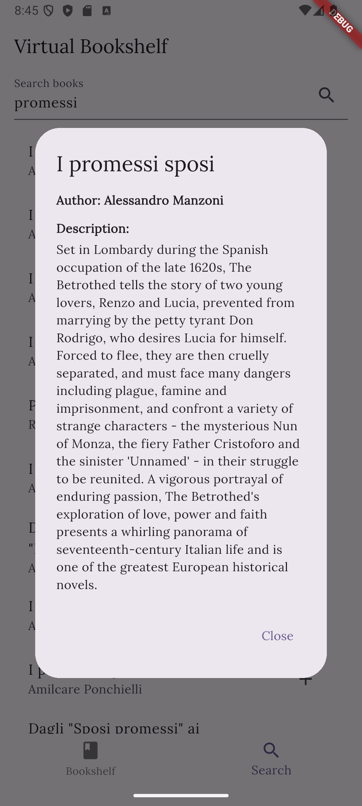

# Virtual Bookshelf - a personal library in your pocket

## Author

**Name:** Mazzoli Leonardo\
**Matriculation number (matricola):** 334321

## Project overview

*Virtual Bookshelf* is a lightweight Flutter application that lets you **search for books via the public OpenLibrary API, save your favourites to a local SQLite database, and manage your reading list completely offline**.  A clean bottom‑navigation UI, instant search suggestions, and persistent local storage make it a handy companion for book lovers on phones, tablets, and even the web/desktop.

---

## User experience

| Common action         | How it works in the UI                                                                                                                                                           |
| --------------------- | -------------------------------------------------------------------------------------------------------------------------------------------------------------------------------- |
| **Search for a book** | Tap the **Search** tab in the bottom navigation bar. Enter a title/author and press the search icon. Results stream in from OpenLibrary and are displayed in a scrollable list. |
| **View book details** | Tap any search result to open a modal sheet showing the full title, author, and extended description (when available).                                                           |
| **Add to bookshelf**  | Press the **+** icon on a search result card or in the detail sheet. A snackbar confirms *Book added!*                                                                           |
| **Browse your shelf** | Tap the **Bookshelf** tab to view every book stored locally. The list is live‑updated via `Provider`.                                                                            |
| **Delete a book**     | Tap the Red trash icon and confirm in the dialog. A snackbar confirms deletion.                                                                          |

> **Screenshots**  
>   
> 

---

## Technology & implementations

| Area | Package | Why |
|------|------------------|-------------------|
| **State management** | `provider` | Lightweight, used mostly for small/medium apps. |
| **HTTP client** | `http` | Simple REST wrapper to call OpenLibrary endpoints. |
| **Local storage** | `sqflite` + `path` | SQLite persistence layer on‑device. |
| **Typography & palette** | `google_fonts` + Material3 `colorSchemeSeed` | To create custom UI elements while paying attention to typography and UX details. |
| **Responsiveness** | Custom `Responsive` utility | One‑liner helpers so the UI scales elegantly in portrait/landscape and on large screens. |
| **Multiplatform** | Flutter web & desktop targets | Same codebase runs on Web, Windows, macOS, and Linux after enabling targets with `flutter config`. |

### Folder structure

```text
lib/
 ├─ models/               # Plain Dart data classes 
 ├─ services/             # Data layer
 ├─ providers/            # App‑level state 
 ├─ pages/                # UI screens
 ├─ utils/                # Shared helpers
 └─ main.dart             # App bootstrap, theme, navigation
```

### How data flows

```
SearchPage  ───────▶  OpenLibraryService  ──HTTP──▶  openlibrary.org
      ▲                                             │
      │                                             ▼
BooksProvider ◀─sqflite── DatabaseHelper ◀──────── BookshelfPage
```

- **Search** operates entirely online; once a book is added it is persisted offline in SQLite.
- **Provider** notifies listening widgets whenever the local database changes, giving an instant updated UI.